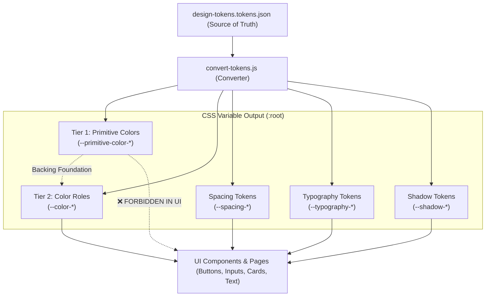

# Design System Tokens & CSS Variable Architecture

This document provides a comprehensive guide to the Design System Tokens extracted from [`design-tokens.tokens.json`](file:///c:/Users/techy-nerdy/Desktop/authentication/design-tokens.tokens.json) and generated via [`convert-tokens.js`](file:///c:/Users/techy-nerdy/Desktop/authentication/convert-tokens.js).

---

## Table of Contents
1. [Architecture Overview](#1-architecture-overview)
2. [The Two-Tier Color System](#2-the-two-tier-color-system)
   - [Tier 1: Primitive Colors (Foundations)](#tier-1-primitive-colors-foundations)
   - [Tier 2: Color Roles (Semantic Application Tokens)](#tier-2-color-roles-semantic-application-tokens)
   - [Why the Separation Matters](#why-the-separation-matters)
3. [Token Reference Tables](#3-token-reference-tables)
   - [Color Roles (UI Application Tokens)](#color-roles-ui-application-tokens)
   - [Primitive Palette Groups](#primitive-palette-groups)
   - [Spacing Tokens](#spacing-tokens)
   - [Typography Tokens](#typography-tokens)
   - [Elevation & Shadow Tokens](#elevation--shadow-tokens)
4. [Conversion Script (`convert-tokens.js`)](#4-conversion-script-convert-tokensjs)
   - [Running the Script](#running-the-script)
   - [CLI Options & Flags](#cli-options--flags)
   - [Generated Output Structure](#generated-output-structure)
5. [Developer Implementation Guide](#5-developer-implementation-guide)
   - [Importing Tokens into CSS](#importing-tokens-into-css)
   - [Component Code Examples](#component-code-examples)
6. [Best Practices & Anti-Patterns](#6-best-practices--anti-patterns)

---

## 1. Architecture Overview

The design token pipeline establishes a single source of truth between Figma design specifications and code. The architecture follows a strict hierarchical token model:



---

## 2. The Two-Tier Color System

The design system implements a two-tier color architecture modeled on Material 3 and modern design token standards.

### Tier 1: Primitive Colors (Foundations)
- **CSS Prefix:** `--primitive-color-*`
- **Definition:** Raw, absolute hex color values defined across tonal steps (`0`, `10`, `20`, ..., `90`, `95`, `98`, `99`, `100`) and key color definitions.
- **Rule:** ⚠️ **NEVER apply primitive colors directly to UI elements in component styles.**
- **Purpose:** Primitives provide the palette palette mathematical baseline. They do not express UI intent or semantic meaning.

### Tier 2: Color Roles (Semantic Application Tokens)
- **CSS Prefix:** `--color-*`
- **Definition:** Context-aware semantic tokens that dynamically resolve to primitive color CSS variables (e.g. `--color-primary: var(--primitive-color-key-primary)`).
- **Rule:** ✅ **ALWAYS use color roles for styling UI components, surfaces, typography, states, and borders.**
- **Purpose:** Color roles communicate intent (e.g., "what should the text on a primary container look like?"). They allow theme changes, accessibility adjustments, and dark mode transitions without modifying component code.

### Why the Separation Matters

| Aspect | ❌ Direct Primitives (Anti-Pattern) | ✅ Semantic Color Roles (Design System Standard) |
|---|---|---|
| **Example** | `background-color: var(--primitive-color-primary-40);` | `background-color: var(--color-primary);` |
| **Component Intent** | Meaning is ambiguous (Why tone 40?) | Crystal clear intent (Primary brand action) |
| **Theme Switching** | Hard-coded; breaks when switching themes | Seamless (re-map role variable in `:root` / `[data-theme]`) |
| **Accessibility** | Prone to poor contrast pairings | Guaranteed WCAG compliance (e.g. `on-primary` is calibrated for `primary`) |
| **Maintainability** | Requires modifying every component file | Single update to token role mapping |

---

## 3. Token Reference Tables

### Color Roles (UI Application Tokens)

These are the primary tokens to use across the application:

| Token Category | CSS Variable | References (Primitive Variable) | Value | Usage Purpose |
|---|---|---|---|---|
| **Primary** | `--color-primary` | `var(--primitive-color-key-primary)` | `#004ed4` | High-emphasis actions, primary buttons, active tabs |
| | `--color-on-primary` | `var(--primitive-color-primary-100)` | `#ffffff` | Text and icons placed on top of `--color-primary` |
| | `--color-primary-container` | `var(--primitive-color-primary-90)` | `#ccdfff` | Low-emphasis primary fills, selected states, badges |
| | `--color-on-primary-container` | `var(--primitive-color-primary-30)` | `#003899` | Text and icons placed on top of `--color-primary-container` |
| **Secondary** | `--color-secondary` | `var(--primitive-color-key-secondary)` | `#003eaa` | Secondary actions, auxiliary buttons, secondary elements |
| | `--color-on-secondary` | `var(--primitive-color-secondary-100)` | `#ffffff` | Text and icons placed on top of `--color-secondary` |
| | `--color-secondary-container` | `var(--primitive-color-secondary-90)` | `#d6e5ff` | Secondary container fills, subtle chips |
| | `--color-on-secondary-container`| `var(--primitive-color-secondary-30)` | `#003eaa` | Text and icons placed on top of `--color-secondary-container` |
| **Tertiary** | `--color-tertiary` | `var(--primitive-color-key-tertiary)` | `#005efe` | Accent highlights, special badges, tertiary actions |
| | `--color-on-tertiary` | `var(--primitive-color-tertiary-100)` | `#ffffff` | Text and icons placed on top of `--color-tertiary` |
| | `--color-tertiary-container` | `var(--primitive-color-tertiary-90)` | `#ccdfff` | Tertiary background fills |
| | `--color-on-tertiary-container` | `var(--primitive-color-tertiary-30)` | `#003999` | Text and icons placed on top of `--color-tertiary-container` |
| **Error** | `--color-error` | `var(--primitive-color-key-error)` | `#c51707` | Form validation errors, destructive actions, alerts |
| | `--color-on-error` | `var(--primitive-color-error-100)` | `#ffffff` | Text and icons placed on top of `--color-error` |
| | `--color-error-container` | `var(--primitive-color-error-90)` | `#fdd2ce` | Error callout backgrounds, error banner fills |
| | `--color-on-error-container` | `var(--primitive-color-error-30)` | `#ad1406` | Text and icons placed on top of `--color-error-container` |
| **Surfaces** | `--color-surface` / `--color-surface-color` | `var(--primitive-color-neutral-98)` | `#f9fafb` | Default page and view background |
| | `--color-on-surface` | `var(--primitive-color-neutral-10)` | `#16181d` | Default body copy and prominent icons |
| | `--color-surface-variant` | `var(--primitive-color-neutral-variant-90)` | `#e5e5e6` | Subtle surface backgrounds, divider lines, borders |
| | `--color-on-surface-variant` | `var(--primitive-color-neutral-variant-30)` | `#4b4c4e` | Secondary body text, placeholder text, captions |
| **Containers** | `--color-surface-container-lowest` | `var(--primitive-color-neutral-100)` | `#ffffff` | Deepest surface (cards on top of colored canvas) |
| | `--color-surface-container-low` | `var(--primitive-color-neutral-98)` | `#f9fafb` | Low-elevation container fills |
| | `--color-surface-container` | `var(--primitive-color-neutral-95)` | `#f0f1f4` | Standard card and dialog container fills |
| | `--color-surface-container-high`| `var(--primitive-color-neutral-90)` | `#e2e4e9` | Elevated container fills |
| | `--color-surface-container-highest` | `var(--primitive-color-neutral-90)` | `#e2e4e9` | Highest elevation container fills, active inputs |
| **Inverse** | `--color-inverse-surface` | `var(--primitive-color-neutral-20)` | `#2c303a` | Snackbars, inverse dark tooltips |
| | `--color-inverse-on-surface` | `var(--primitive-color-neutral-95)` | `#f0f1f4` | Text on inverse surfaces |
| | `--color-surface-tint` | `var(--primitive-color-primary-40)` | `#004bcc` | Elevation tint overlays |

---

### Primitive Palette Groups

*(Foundations only - used internally by `--color-*` variables)*

- **Key Colors (`--primitive-color-key-*`):**
  - `--primitive-color-key-primary`: `#004ed4`
  - `--primitive-color-key-secondary`: `#003eaa`
  - `--primitive-color-key-tertiary`: `#005efe`
  - `--primitive-color-key-neutral`: `#16181d`
  - `--primitive-color-key-neutral-variant`: `#38393a`
  - `--primitive-color-key-error`: `#c51707`
- **Tonal Palettes (0 = Pure Black, 100 = Pure White):**
  - Primary: `--primitive-color-primary-0` through `--primitive-color-primary-100` (14 stops)
  - Secondary: `--primitive-color-secondary-0` through `--primitive-color-secondary-100` (14 stops)
  - Tertiary: `--primitive-color-tertiary-0` through `--primitive-color-tertiary-100` (14 stops)
  - Neutral: `--primitive-color-neutral-0` through `--primitive-color-neutral-100` (14 stops)
  - Neutral Variant: `--primitive-color-neutral-variant-0` through `--primitive-color-neutral-variant-100` (14 stops)
  - Error: `--primitive-color-error-0` through `--primitive-color-error-100` (14 stops)

---

### Spacing Tokens

Standardized 4px baseline dimensional units:

| Token Name | Main CSS Variable | Shorthand Aliases | Pixel Value | Rem Value | Common Usage |
|---|---|---|---|---|---|
| `no spacing` | `--spacing-no-spacing` | `--spacing-0`, `--spacing-none` | `0px` | `0rem` | Reset margins/paddings |
| `extra small spacing`| `--spacing-extra-small-spacing` | `--spacing-xs`, `--spacing-4` | `4px` | `0.25rem` | Icon gaps, tight badge padding |
| `small spacing` | `--spacing-small-spacing` | `--spacing-sm`, `--spacing-8` | `8px` | `0.5rem` | Button horizontal padding, form field gaps |
| `medium spacing` | `--spacing-medium-spacing` | `--spacing-md`, `--spacing-12` | `12px` | `0.75rem` | Card inner margins, standard element gaps |
| `base spacing` | `--spacing-base-spacing` | `--spacing-base`, `--spacing-16` | `16px` | `1rem` | Standard page padding, card padding |
| `large spacing` | `--spacing-large-spacing` | `--spacing-lg`, `--spacing-20` | `20px` | `1.25rem` | Section spacing, container padding |
| `extra large spacing`| `--spacing-extra-large-spacing` | `--spacing-xl`, `--spacing-24` | `24px` | `1.5rem` | Form group spacing, modal padding |
| `very large spacing` | `--spacing-very-large-spacing` | `--spacing-2xl`, `--spacing-32` | `32px` | `2rem` | Layout gutter, header margin |

---

### Typography Tokens

All typography tokens standardize on Google Font **DM Sans** (`'DM Sans', sans-serif`).

| Scale / Role | Font Size | Line Height | Weight | Letter Spacing | Utility Class |
|---|---|---|---|---|---|
| **Display Large** | `64px` | `96px` | `500` (Medium) | `-4px` | `.text-display-large` |
| **Display Medium**| `50px` | `75px` | `500` (Medium) | `-3px` | `.text-display-medium` |
| **Display Small** | `40px` | `60px` | `500` (Medium) | `-2.3px` | `.text-display-small` |
| **Headline Large**| `32px` | `48px` | `500` (Medium) | `-1.55px` | `.text-headline-large` |
| **Headline Medium**| `28px` | `42px` | `500` (Medium) | `-1.35px` | `.text-headline-medium` |
| **Headline Small** | `24px` | `36px` | `500` (Medium) | `-1px` | `.text-headline-small` |
| **Title Large** | `22px` | `33px` | `500` (Medium) | `-1px` | `.text-title-large` |
| **Title Medium** | `16px` | `24px` | `600` (SemiBold) | `-0.85px` | `.text-title-medium` |
| **Title Small** | `14px` | `21px` | `400` (Regular) | `-0.75px` | `.text-title-small` |
| **Body Large** | `16px` | `24px` | `500` (Medium) | `-0.8px` | `.text-body-large` |
| **Body Medium** | `14px` | `21px` | `500` (Medium) | `-0.75px` | `.text-body-medium` |
| **Body Small** | `12px` | `18px` | `400` (Regular) | `-0.75px` | `.text-body-small` |
| **Label Large** | `14px` | `21px` | `500` (Medium) | `-0.9px` | `.text-label-large` |
| **Label Medium** | `12px` | `18px` | `500` (Medium) | `-0.9px` | `.text-label-medium` |
| **Label Small** | `11px` | `16.5px` | `500` (Medium) | `-0.8px` | `.text-label-small` |

---

### Elevation & Shadow Tokens

| Token Name | CSS Variable | Shorthand Variable | Value | Utility Class |
|---|---|---|---|---|
| **Hard Shadow** | `--effect-hard-shadow` | `--shadow-hard` | `4px 6px 8px 0px rgba(0, 0, 0, 0.322)` | `.shadow-hard` |
| **Medium Shadow** | `--effect-medium-shadow` | `--shadow-medium` | `2px 4px 6px 0px rgba(0, 0, 0, 0.278)` | `.shadow-medium` |
| **Soft Shadow** | `--effect-soft-shadow` | `--shadow-soft` | `2px 2px 20px 0px rgba(0, 0, 0, 0.122)` | `.shadow-soft` |

---

## 4. Conversion Script (`convert-tokens.js`)

The generator is a zero-dependency, high-performance Node.js utility designed for rapid execution and seamless CI/CD integration.

### Running the Script

```bash
# Generate consolidated CSS at default path (styles/tokens.css)
node convert-tokens.js

# Generate both consolidated CSS and modular split files
node convert-tokens.js --split

# Specify custom input and output targets
node convert-tokens.js --input ./design-tokens.tokens.json --output ./src/styles/tokens.css
```

### CLI Options & Flags

```
Options:
  -i, --input <file>       Path to source design tokens JSON (default: ./design-tokens.tokens.json)
  -o, --output <file>      Path to output consolidated CSS file (default: ./styles/tokens.css)
  -s, --split              Output modular CSS files by category
  -d, --outdir <dir>       Directory for split output files (default: ./styles/tokens/)
  --no-utilities           Skip generating typography & elevation utility classes
  -h, --help               Show help menu
```

### Generated Output Structure

When running with `--split`, the following bundle is created:

```
styles/
├── tokens.css               # Consolidated master file (primitives + roles + spacing + typo + shadows)
└── tokens/
    ├── index.css            # Barrel import (@import primitives, roles, spacing, effects, typography)
    ├── primitives.css       # Tier 1 foundational variables
    ├── color-roles.css      # Tier 2 semantic UI variables
    ├── spacing.css          # Spacing variables & shorthands
    ├── typography.css       # Font variables and .text-* utility classes
    └── effects.css          # Shadow variables and .shadow-* utility classes
```

---

## 5. Developer Implementation Guide

### Importing Tokens into CSS

In your application's global stylesheet (`globals.css` or `layout.tsx`):

```css
/* Option A: Import consolidated file */
@import './styles/tokens.css';

/* Option B: Import modular bundle */
@import './styles/tokens/index.css';
```

### Component Code Examples

#### 1. Primary Action Button
```css
.btn-primary {
  display: inline-flex;
  align-items: center;
  justify-content: center;
  padding: var(--spacing-sm) var(--spacing-base);
  gap: var(--spacing-xs);
  
  /* Semantic Color Roles */
  background-color: var(--color-primary);
  color: var(--color-on-primary);
  
  /* Typography & Effects */
  font-family: var(--typography-label-large-font-family);
  font-size: var(--typography-label-large-font-size);
  font-weight: var(--typography-label-large-font-weight);
  box-shadow: var(--shadow-soft);
  border: none;
  border-radius: 8px;
  cursor: pointer;
  transition: background-color 0.2s ease, box-shadow 0.2s ease;
}

.btn-primary:hover {
  background-color: var(--color-secondary);
  box-shadow: var(--shadow-medium);
}
```

#### 2. Surface Card Container
```css
.card {
  background-color: var(--color-surface-container-lowest);
  color: var(--color-on-surface);
  border: 1px solid var(--color-surface-variant);
  border-radius: 12px;
  padding: var(--spacing-xl);
  box-shadow: var(--shadow-soft);
}

.card-title {
  font-family: var(--typography-title-large-font-family);
  font-size: var(--typography-title-large-font-size);
  font-weight: var(--typography-title-large-font-weight);
  line-height: var(--typography-title-large-line-height);
  color: var(--color-on-surface);
  margin-bottom: var(--spacing-xs);
}

.card-description {
  font-family: var(--typography-body-medium-font-family);
  font-size: var(--typography-body-medium-font-size);
  color: var(--color-on-surface-variant);
}
```

#### 3. Text Input Field
```css
.input-field {
  width: 100%;
  padding: var(--spacing-sm) var(--spacing-md);
  background-color: var(--color-surface-container-low);
  color: var(--color-on-surface);
  border: 1px solid var(--color-surface-variant);
  border-radius: 8px;
  font-family: var(--typography-body-large-font-family);
  font-size: var(--typography-body-large-font-size);
  outline: none;
  transition: border-color 0.2s ease;
}

.input-field:focus {
  border-color: var(--color-primary);
  background-color: var(--color-surface-container-lowest);
}

.input-field.error {
  border-color: var(--color-error);
}

.input-error-message {
  color: var(--color-error);
  font-family: var(--typography-label-small-font-family);
  font-size: var(--typography-label-small-font-size);
  margin-top: var(--spacing-xs);
}
```

#### 4. Error Alert Banner
```css
.alert-error {
  background-color: var(--color-error-container);
  color: var(--color-on-error-container);
  border: 1px solid var(--color-error);
  padding: var(--spacing-md) var(--spacing-base);
  border-radius: 8px;
  display: flex;
  align-items: center;
  gap: var(--spacing-sm);
  font-family: var(--typography-body-medium-font-family);
  font-size: var(--typography-body-medium-font-size);
}
```

---

## 6. Best Practices & Anti-Patterns

### 🟢 Best Practices
- **Always pair background and text tokens**: Pair `--color-primary` with `--color-on-primary`, `--color-surface` with `--color-on-surface`, `--color-error-container` with `--color-on-error-container`.
- **Use Spacing Shorthands**: Utilize `--spacing-xs`, `--spacing-sm`, `--spacing-md`, `--spacing-base`, `--spacing-lg`, `--spacing-xl` for clean, readable layouts.
- **Compose Typography**: Use the `.text-*` utility classes for rapid layout construction, or reference the explicit font size/weight variables in scoped component CSS.
- **Run the converter on token updates**: Re-run `node convert-tokens.js` whenever `design-tokens.tokens.json` is exported from Figma.

### 🔴 Anti-Patterns
- **❌ DO NOT use `--primitive-color-*` in CSS component classes**:
  ```css
  /* ❌ BAD - Breaks design system abstraction */
  .button {
    background-color: var(--primitive-color-primary-40);
  }

  /* ✅ GOOD - Semantic and future-proof */
  .button {
    background-color: var(--color-primary);
  }
  ```
- **❌ DO NOT hardcode pixel values when tokens exist**:
  ```css
  /* ❌ BAD */
  margin-top: 16px;
  box-shadow: 2px 2px 20px rgba(0, 0, 0, 0.12);

  /* ✅ GOOD */
  margin-top: var(--spacing-base);
  box-shadow: var(--shadow-soft);
  ```
- **❌ DO NOT invent custom color values**: All colors in the authentication slice must map directly to the defined design system color roles.
